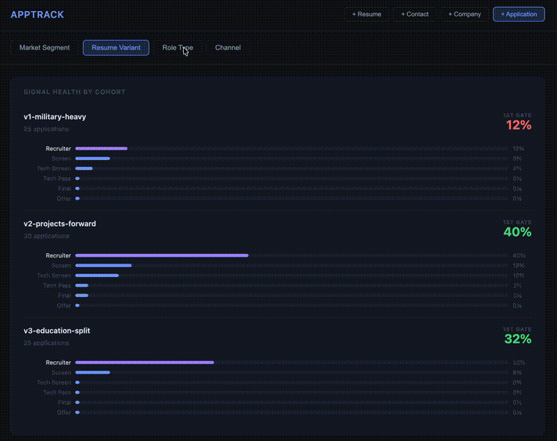

## Apptrack: Hiring Pipeline Instrumentation

A lightweight tool for tracking feedback from the hiring pipeline. Built with Spring Boot 4, PostgreSQL, and vanilla JS.

### What it tracks

Applications are segmented by resume variant, market segment, source channel, and referral status. Each stage transition is timestamped and recorded as a pipeline event. Qualitative observations from recruiter calls and interviews are tagged to specific touchpoints so signal patterns can be traced back to their source.

### Why

The software engineering hiring process produces outcomes you can observe but not directly explain. Recruiter responses, online assessments, interviews, and rejections are visible. The criteria behind them are not. The only lever I can really pull in this process is visible hiring signal, and I want something better than a spreadsheet to keep track of what works.

This project models each job application as an instance moving through a state machine. Every pipeline transition is recorded alongside the signals presented to the employer at that time: which resume variant was used, the source channel, whether a referral was involved, and qualitative observations from any human touchpoints.

Job listings are stored with each application because postings disappear quickly and are frequently edited. Preserving the original listing keeps the requirements and context tied to an application available for later comparison.

Over time the collected transitions allow basic analysis: which resume variants correlate with recruiter responses, which channels produce interviews, where the pipeline consistently stalls. The goal is not predictive accuracy, it's observability over a process that is otherwise entirely anecdotal, and decision justification for modifying what signals I put in.